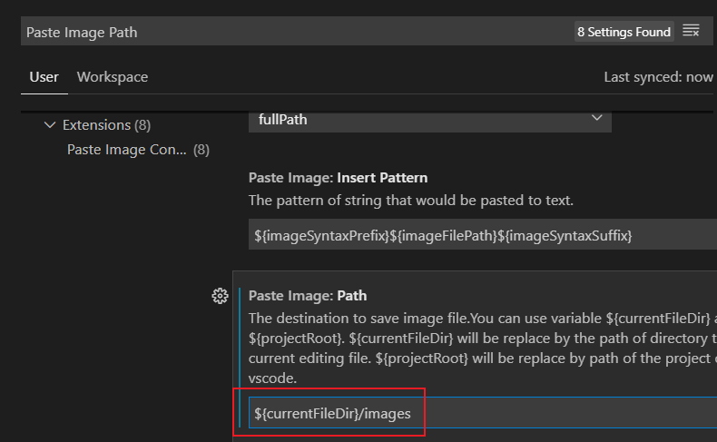

# Hello, world!

# 一级标题

## 二级标题

### 三级标题

每写完一个段落要隔一行空行.

就像这样，隔了一行空行.

---

分割线

**重点加粗**

*斜体*

~~删除线~~

---

列表：

* 无序列表
    * 嵌套无序列表
    * 嵌套无序列表
* 无序列表
* 无序列表

1. 有序列表 1
   1. 嵌套有序列表 1
   2. 嵌套有序列表 2
2. 有序列表 2
3. 有序列表 3

---

引用文本：

> 引用别人说的话
> 就这样写
> By. JvTU_Axiomer

---

这是 `行内代码` 语法.

代码块语法：

``` python
print("Hello, World!")
```

请将 ' 替换成 `.

---

[超链接名称](链接地址)


---

表格：

| 表头 | 表头 |
| ---- | ---- |
| 内容 | 内容 |
| 内容 | 内容 |

---

注释：

<!-- 你看不见我 -->

---

标题：

你可以用：

# 一级标题

## 二级标题

### 三级标题

段落.

或者：

一级标题
=======

二级标题
-------

的方式表示标题，个人更推荐前一种方式.（不用对齐，强迫症福音！）

---

段落：

段落和段落之间要隔一行.

就像这样.

---

分割线：

三条横线（或更多的横线）表示分割线.

---

就像这样.

---

加粗，斜体和删除线

做笔记的时候，我们常常会有这样的要求，“加粗，斜体和删除线”，作为笔记的

**重点加粗**

*斜体*

~~删除线~~

---

Markdown Preview Enhanced拓展功能：

==高亮==

---

快捷键：

选中文本之后，按下Ctrl + B可以给**选中文本**加粗.

同理Ctrl + I可以让*选中文本*变为斜体.

---

列表：

列表是记笔记时非常基本的元素，在Markdown中，可以用很方便的格式书写列表：

* 无序列表
    * 嵌套无序列表
    * 嵌套无序列表
* 无序列表
* 无序列表

1. 有序列表 1
   1. 嵌套有序列表 1
   2. 嵌套有序列表 2
2. 有序列表 2
3. 有序列表 3

---

Markdown Preview Enhanced拓展功能：

任务列表：

- [x] 已经完成的事 1
- [x] 已经完成的事 2
- [x] 已经完成的事 3
- [ ] 仍未完成的事 4
- [ ] 仍未完成的事 5

---

快捷键：

要进行**缩进**（书写嵌套列表），你可以使用VS Code的快捷键Ctrl + [ 和 Ctrl + ].

这个快捷键可以将代码向左或向右进行缩进！

---

引用和代码：

引用文本：

> 引用别人说的话
> 就这样写
> By. JvTU_Axiomer

---

这是 `行内代码` 语法.

代码块语法：

``` python
print("Hello, World!")
```

注意要将 ' 替换成 `.

---

Markdown Preview Enhanced拓展功能：

代码行数的显示：

``` javascript {.line-numbers}
function add(x, y) {
    return x + y;
}
```

注意要将 ' 替换成 `.

---

超链接和图片：

你可以用下面的语法插入超链接和图片：

[超链接名称](链接地址)


例如，可以使用网址和图床：

[OrangeX4's Blog](https://orangex4.cool/)


也可以在本地使用相对地址：

[Other](other.md)


---

剪贴板图片插入：

快捷键：Ctrl + Alt + V



---

表格：

你可以很方便地在做笔记的时候加入表格：

表格:

| 表头 | 表头 |
| ---- | ---- |
| 内容 | 内容 |
| 内容 | 内容 |

---

Markdown Preview Enhanced拓展功能：

拓展语法：

| 表头 | 表头 |
| ---- | ---- |
| 内容 | 内容 |
| >    | 内容 |

| 表头 | 表头 |
| ---- | ---- |
| 内容 | 内容 |
| ^    | 内容 |

---

快捷键：

自动表格对齐：Shift + Alt + F

---

注释：

快捷键：Ctrl + \ 将当前行注释/反注释.

<!-- 你看不见我 -->

<!-- 多行注释
就像这样 -->

---

自动目录：

[TOC]

---

VS Code 语法知识：

[VS Code 语法知识墙](https://orangex4.cool/post/notes-in-markdown/)

---

Git廖雪峰教程：

[Git廖雪峰教程](https://www.liaoxuefeng.com/wiki/896043488029600)